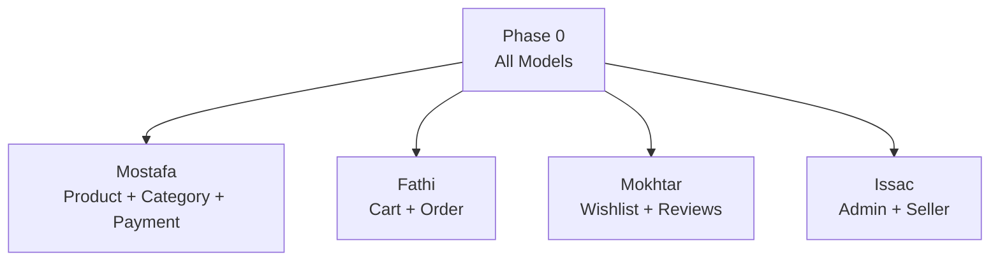

# E-Commerce Project — Task Division

> **Team**: Mostafa · Fathi · Mokhtar · Issac
> **Stack**: Express · Mongoose · JWT · Cloudinary · Joi · Nodemailer
> **Date**: 2026-02-10

---

## Current Project Structure

```
E-Commerce/
├── index.js                          # App entry point
├── package.json
├── .env
├── docs/
│   └── project_requirments.txt
└── src/
    ├── DB/
    │   ├── connection.js             # MongoDB connection
    │   └── Models/
    │       ├── user.js               # User model (roles: user, admin; providers: google, system)
    │       └── OTP.js                # OTP model (auto-expires 5 min)
    ├── middleware/
    │   ├── auth.middleware.js         # JWT authentication
    │   ├── authorization.middleware.js # Role-based authorization
    │   └── validation.middleware.js   # Joi schema validation
    ├── modules/
    │   ├── app.controller.js          # Bootstrap (routes, cors, error handling)
    │   ├── auth/
    │   │   ├── auth.controller.js     # Auth routes (register, login, gmail, activate, forget/reset, refresh)
    │   │   ├── auth.service.js        # Auth business logic
    │   │   └── auth.validation.js     # Auth Joi schemas
    │   └── User/
    │       ├── user.controller.js     # User routes (profile, images, password, freeze, otp, share, email, logout)
    │       ├── user.service.js        # User business logic
    │       └── user.validation.js     # User Joi schemas
    └── utils/
        ├── email/                     # Email sending & event emitters
        ├── encryption/                # CryptoJS encryption utils
        ├── error handling/            # asyncHandler & globalHandler
        ├── hashing/                   # bcrypt hash & compare
        ├── multer/                    # Cloudinary upload config
        ├── otp/                       # OTP generation & event emitters
        └── token/                     # JWT generate & verify
```

---

## ✅ Completed Work (Foundation + User Domain)

| Area                           | Status  | Details                                                                                                   |
| ------------------------------ | ------- | --------------------------------------------------------------------------------------------------------- |
| **Project Setup**              | ✅ Done | Express app, DB connection, CORS, env config                                                              |
| **User Model**                 | ✅ Done | userName, email, password, profilePicture, profileCover, role, provider, isActivated, isDeleted, isLogged |
| **OTP Model**                  | ✅ Done | email, otp (hashed), auto-expire 5 min                                                                    |
| **Auth — Register**            | ✅ Done | Email uniqueness check, create user, send activation email                                                |
| **Auth — Login**               | ✅ Done | Email/password login, returns access + refresh tokens                                                     |
| **Auth — Google Login**        | ✅ Done | Google OAuth2 id-token verification, auto-register                                                        |
| **Auth — Activate Account**    | ✅ Done | Token-based email verification                                                                            |
| **Auth — Forget Password**     | ✅ Done | OTP sent to email                                                                                         |
| **Auth — Reset Password**      | ✅ Done | OTP verification + password update                                                                        |
| **Auth — Refresh Token**       | ✅ Done | New access token from refresh token                                                                       |
| **User — Get Profile**         | ✅ Done | Returns authenticated user data                                                                           |
| **User — Update Profile**      | ✅ Done | Update userName                                                                                           |
| **User — Profile Image**       | ✅ Done | Upload to Cloudinary                                                                                      |
| **User — Cover Images**        | ✅ Done | Upload multiple covers to Cloudinary                                                                      |
| **User — Change Password**     | ✅ Done | Old password verification + update                                                                        |
| **User — Update Email**        | ✅ Done | Password re-verification + email confirmation flow                                                        |
| **User — Freeze Account**      | ✅ Done | Soft-delete (isDeleted: true)                                                                             |
| **User — Reactivate Account**  | ✅ Done | Send OTP → Verify OTP → reactivate                                                                        |
| **User — Share Profile**       | ✅ Done | Public profile view by userId                                                                             |
| **User — Logout**              | ✅ Done | Remove token                                                                                              |
| **Middleware — Auth**          | ✅ Done | JWT verification, user lookup                                                                             |
| **Middleware — Authorization** | ✅ Done | Role-based access control                                                                                 |
| **Middleware — Validation**    | ✅ Done | Joi schema validation                                                                                     |
| **Utils**                      | ✅ Done | email, encryption, hashing, multer/Cloudinary, OTP, token, error handling                                 |
| **Category Model**             | ✅ Done | `name`, `slug`, `image`, `parentCategoryId`, `createdBy`                                                  |
| **Product Model**              | ✅ Done | `title`, `slug`, `price`, `stock`, `images`, `sellerId`, `avgRating`, `isDeleted`                         |
| **Cart Model**                 | ✅ Done | `userId`, `products`, `totalPrice`                                                                        |
| **Order Model**                | ✅ Done | `userId`, `products`, `shippingAddress`, `paymentStatus`, `orderStatus`                                   |
| **Review Model**               | ✅ Done | `userId`, `productId`, `rating`, `comment`                                                                |
| **Banner Model**               | ✅ Done | `title`, `image`, `link`, `isActive`, `createdBy`                                                         |
| **User Model Updates**         | ✅ Done | Added `seller` role, `wishlist`, `phone`, `address`                                                       |

---

## 🔲 Remaining Work — Domain Assignments

Each developer owns **one domain end-to-end**: validation → service → controller → route registration.

---

### 👤 Mostafa — Product Management + Category + Payment Integration

> Owns the Product & Category domain + Payment gateway.

#### Category

- [ ] POST `/category` — create category (admin only)
- [ ] GET `/category` — list all categories
- [ ] GET `/category/:categoryId` — get single category
- [ ] PATCH `/category/:categoryId` — update category (admin only)
- [ ] DELETE `/category/:categoryId` — delete category (admin only)
- [ ] Validation schemas for category

#### Product ⭐

- [ ] POST `/product` — create product (seller/admin)
- [ ] GET `/product` — list all products
- [ ] GET `/product/:productId` — get single product (with reviews populated)
- [ ] PATCH `/product/:productId` — update product (owner/admin)
- [ ] DELETE `/product/:productId` — soft-delete product (owner/admin)
- [ ] **Search** — GET `/product?search=keyword` (search by name)
- [ ] **Filtration** — GET `/product?minPrice=&maxPrice=&categoryId=` (filter by price, category)
- [ ] **Sorting** — GET `/product?sort=price,-createdAt`
- [ ] **Pagination** — GET `/product?page=1&limit=10`
- [ ] Product image upload (main + gallery) via Cloudinary
- [ ] Validation schemas for product

#### Payment Integration

- [ ] Integrate **Stripe** (or PayPal) payment gateway
- [ ] POST `/payment/create-intent` — create payment intent (Stripe)
- [ ] POST `/payment/webhook` — handle Stripe webhook for payment confirmation
- [ ] Handle payment success → create order
- [ ] Handle payment failure → return error, keep cart intact
- [ ] _(bonus)_ Card saving & auto-fill for quick checkout

---

### 👤 Fathi — Shopping Cart + Checkout + Order

> Owns the purchase flow: Cart → Checkout → Order creation & tracking.

#### Shopping Cart

- [ ] POST `/cart` — add product to cart
- [ ] GET `/cart` — get user's cart
- [ ] PATCH `/cart/:productId` — update quantity of item in cart
- [ ] DELETE `/cart/:productId` — remove item from cart
- [ ] DELETE `/cart` — clear entire cart
- [ ] Auto-calculate `totalPrice` on every update
- [ ] Validate stock availability before adding to cart
- [ ] Validation schemas for cart

#### Checkout

- [ ] POST `/checkout` — order summary with price breakdown (subtotal, shipping, tax, total)
- [ ] Guest checkout option (allow checkout without auth, capture email)
- [ ] Multiple payment method selection (Credit Card, PayPal, COD, Wallet)
- [ ] _(bonus)_ Apply promo codes & discounts → validate promo code, calculate discount

#### Order ⭐

- [ ] POST `/order` — place a new order
  - [ ] Validate cart / product availability
  - [ ] Deduct stock from Product model
  - [ ] Clear user's cart after successful order
  - [ ] Generate unique order number (e.g. using `nanoid`)
  - [ ] Set initial `orderStatus: 'pending'`
- [ ] GET `/order` — get user's orders (list with pagination)
- [ ] GET `/order/:orderId` — get single order details
- [ ] PATCH `/order/:orderId/cancel` — cancel order (user, only if `pending` or `confirmed`)
  - [ ] Restore stock on cancellation
- [ ] Send **order confirmation email** to user (using existing email utils)
- [ ] Send email on **status change** (shipped, delivered, cancelled)

---

### 👤 Mokhtar — Wishlist + Reviews & Ratings

> Standalone CRUD modules. Independent of other core flows.

#### Wishlist & Favorites

- [ ] GET `/user/wishlist` — get user wishlist (populated with product data)
- [ ] POST `/user/wishlist/:productId` — add product to wishlist
- [ ] DELETE `/user/wishlist/:productId` — remove product from wishlist
- [ ] Prevent duplicate products in wishlist
- [ ] Validation schemas for wishlist

#### Reviews & Ratings

- [ ] POST `/review/:productId` — add review (one review per user per product)
- [ ] GET `/review/:productId` — get all reviews for a product (with pagination)
- [ ] PATCH `/review/:reviewId` — update own review
- [ ] DELETE `/review/:reviewId` — delete own review
- [ ] Update `avgRating` and `ratingCount` on Product model when review is added/updated/deleted
- [ ] Validation schemas for review

---

### 👤 Issac — Admin Panel + Seller Management

> Dashboard & management features. Independent of core user flows.

#### Admin Panel

- [X] GET `/admin/users` — list all users (with pagination, search)
- [X] PATCH `/admin/users/:userId/restrict` — soft-delete / restrict user
- [X] PATCH `/admin/users/:userId/approve` — re-approve user
- [X] GET `/admin/products` — list all products (with filters)
- [ ] DELETE `/admin/products/:productId` — remove a product
- [ ] GET `/admin/orders` — list all orders (with filters, status)
- [ ] PATCH `/admin/orders/:orderId` — update order/shipping status
  - [ ] Validate status transition (e.g., can't go from `delivered` → `processing`)
- [ ] CRUD `/admin/banners` — content management for homepage banners
- [ ] _(bonus)_ CRUD `/admin/promo` — discount & promo-code management

#### Seller (Vendor) Management

- [ ] Add seller-specific fields to User model (OR create separate Seller profile model): `storeName`, `storeDescription`, `storeImage`
- [ ] Seller registration & profile setup
- [ ] GET `/seller/profile` — seller own profile
- [ ] PATCH `/seller/profile` — update seller profile
- [ ] GET `/seller/products` — seller's own product listings
- [ ] GET `/seller/inventory` — stock/inventory overview
- [ ] _(bonus)_ GET `/seller/orders` — seller's received orders with status updates

---

## Cross-Module Dependencies



> **Key points:**
>
> 1. **Phase 0** — everyone creates their models together, no blocking
> 2. After models are ready, all four developers work **in parallel** on their domains

---

## 📌 Conventions to Follow

| Convention             | Rule                                                                            |
| ---------------------- | ------------------------------------------------------------------------------- |
| **Folder per module**  | `src/modules/<ModuleName>/` with `controller.js`, `service.js`, `validation.js` |
| **Models**             | `src/DB/Models/<model>.js`                                                      |
| **Route registration** | Register in `src/modules/app.controller.js`                                     |
| **Auth middleware**    | Use `isAuthenticated` + `isAuthorized(roles.xxx)`                               |
| **Error handling**     | Use `asyncHandler` wrapper + `next(new Error(msg, {cause: statusCode}))`        |
| **Validation**         | Joi schemas + `validation()` middleware                                         |
| **File uploads**       | Use existing Cloudinary config in `utils/multer/`                               |
| **Emails**             | Use existing event-emitter pattern in `utils/email/`                            |

---

## 🗓️ Execution Order

| Phase       | Who          | What                                              |
| ----------- | ------------ | ------------------------------------------------- |
| **Phase 0** | **Everyone** | Create all models together                        |
| **Phase 1** | **Mostafa**  | Category + Product CRUD + Search/Filter + Payment |
| **Phase 1** | **Fathi**    | Cart + Checkout + Order                           |
| **Phase 1** | **Mokhtar**  | Wishlist + Reviews & Ratings                      |
| **Phase 1** | **Issac**    | Admin Panel + Seller Management                   |
